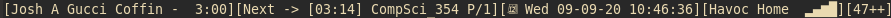
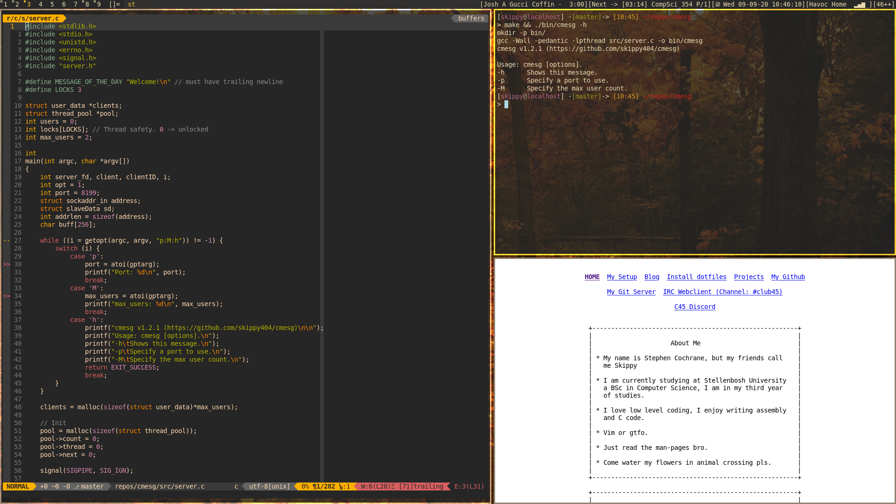
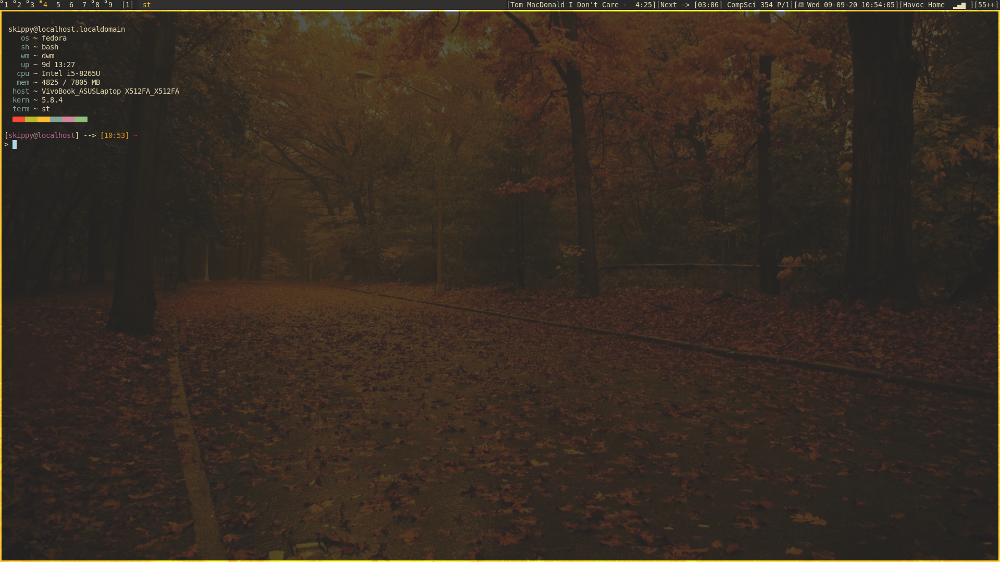

# dwm
My dwm fork from suckless dwm

## Dependencies
### Build Dependencies
Without these dependences, you cannot build the project, and so these are "hard"
dependences, they are,

* X11 Header files
* Make/GNU Make
* C compiler

### Optional Dependencies
My dwm fork can be run without these dependences installed, and so these are "soft"
dependencies, but if you install them, extra features become availiable.

|Dependency|Bar Feature|
|----------|-------|
|acpi|Battery Information|
|nmcli|Display WiFi Information|

## Installing
Simply type,
````
$ make
````
You will be prompted for sudo when it is needed

## Usage
Once installed, when logging in, you will be able to select dwm from your login
manager.

## Bar



* First block  -> Current song.
* Second block -> Next appointment in your calander (uses calcurse).
* Third block  -> Date.
* Fourth block -> Wifi status.
* Fifth block  -> Battery status (++ means charging, -- means discharging).

## Desktop




